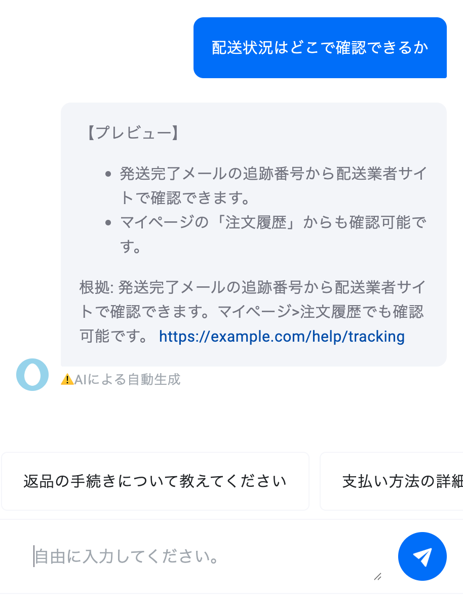
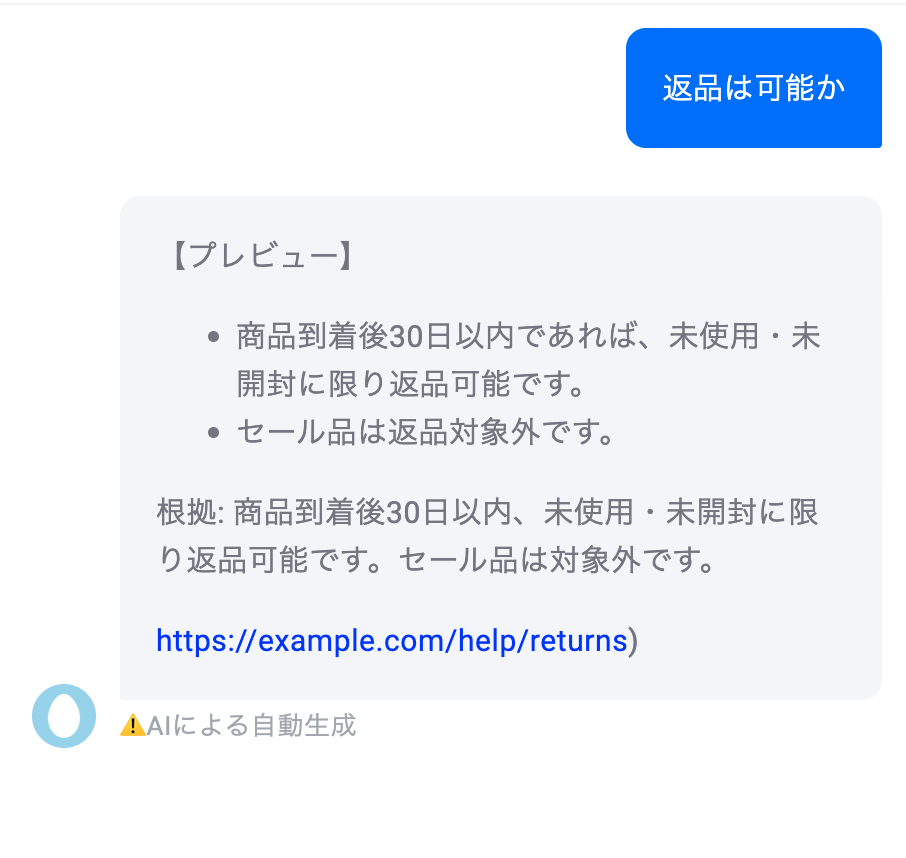

# EC FAQ RAG Chatbot (miibo × RAG)

## 概要
ECサイトのFAQに対して、miiboを用いたRAG構成のチャットボットを実装した。  
ユーザーからの質問に自動応答し、必ず根拠URLと抜粋を提示することで信頼性を担保する。  
また、FAQ外の質問に対しては推測せず、エスカレーション案内を返すように設計している。

---

## 仮想要件定義

### プロジェクト名
EC-CS FAQチャットボット（miibo × RAG）

### 背景・目的
- ECサイトの問い合わせ（配送・返品・支払い）が多い。  
- 一次回答の自動化と根拠提示でハルシネーションを抑制し、一次解決率を向上させる。

### 主要ユーザーストーリー
1. ユーザーとして、配送に関する質問をすると具体的な回答と根拠URLがほしい。  
2. ユーザーとして、FAQ外の質問をしたときに推測せずエスカレーション手順を知りたい。  
3. オペレーターとして、FAQを更新すれば即時に反映されてほしい。  
4. 管理者として、問い合わせログとヒット文書を確認したい。  

### 作用範囲（スコープ）
- 対象カテゴリ: `shipping / returns / payment`（v1）  
- 連携: v1はナレッジのみ、v1.1でWebhook連携を予定。  

### 非機能要件（NFR）
- 応答時間: P50 ≤ 3秒  
- 品質指標:  
  - 正答率: ≥90%  
  - 根拠一致率: ≥95%  
  - Fallback適正率: FAQ外では推測回答ゼロ  
- 運用: 更新は管理者1名・5分以内で完了  

### 受入基準
- [ ] 代表質問5件に必ず根拠URL＋抜粋が提示される  
- [ ] FAQ外質問ではエスカレーション文面が返る  
- [ ] カテゴリフィルタで無関係根拠が混入しない  
- [ ] （任意）Notion/URL読み込みで即時反映が確認できる  

---

## RAG設計
- **チャンク**: 300–600文字  
- **Top-k**: 3（比較用に5もテスト）  
- **メタデータ**: `category`, `language`, `policy_version`  
- **前段フィルタ**: 質問からカテゴリ推定 → 該当カテゴリのみ検索  
- **根拠提示**: URL＋原文抜粋（<=120字）。根拠ゼロなら回答禁止 → エスカレーション  

---

## 実装（miibo）
- ナレッジ: 配送 / 返品 / 支払い を3文書に分割し、それぞれにカテゴリを付与  
- プロンプト: 検索ルール、根拠必須、Fallbackルールを追記  
- 公開設定: 限定公開URLを発行（応募用に提示可能）  

---

## テストケース

### ケース1: 配送状況確認
- **入力**: 「配送状況はどこで確認できるか」
- **出力例**
  - 発送完了メールの追跡番号から配送業者サイトで確認できます。
  - マイページの「注文履歴」からも確認可能です。
  - 根拠: [https://example.com/help/tracking](https://example.com/help/tracking)
- ✅ 想定通りの回答と根拠URLを返却。

---

### ケース2: 返品は可能か
- **入力**: 「返品は可能か」
- **出力例**
  - 商品到着後30日以内であれば、未使用・未開封に限り返品可能です。
  - セール品は対象外です。
  - 根拠: [https://example.com/help/returns](https://example.com/help/returns)
- ✅ 返品条件が正しく提示された。

---

### ケース3: 不明な質問（営業時間）
- **入力**: 「営業時間は？」
- **出力例**
  - 申し訳ありませんが、営業時間に関する情報は現在手元にありません。  
    詳細は担当へエスカレーションさせていただきます。
- ✅ 想定外質問に対して推測せずエスカレーション案内。

---

## 成果物（スクリーンショット例）

### ナレッジ登録

### 配送テスト

### 返品テスト

### エスカレーション例

---

## 今後の改善
- Webhook連携による実データ参照（注文API）  
- ナレッジ更新フローの自動化（Notion/URL同期）  
- 評価セット自動化（CSVでのテスト）  

---
